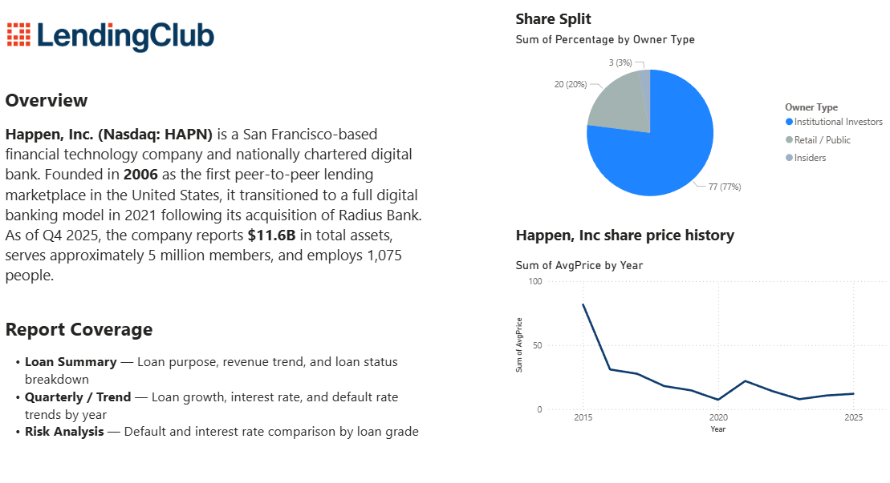

# 📊 LendingClub Credit Risk & Portfolio Analytics Dashboard

A Power BI dashboard analyzing **2.26M+ loan records** and **$34B+ in loan volume** to uncover the relationship between loan growth, pricing strategy, and credit risk at LendingClub (2007–2018).


---

## 📌 Overview

This project analyzes LendingClub's historical peer-to-peer loan portfolio to answer one core question:

> **Is loan growth healthy, or is credit risk quietly rising alongside it?**

The dashboard connects loan volume, interest rate pricing, and default rate across a 4-page report, built entirely in Power BI using custom DAX measures and verified external data (SEC filings, stock price history, ownership structure).

---
## 🚀 How to View

| Step | Action |
|---|---|
| 1️⃣ | Download [`DASHBOARD.pbix`](./DASHBOARD.pbix) |
| 2️⃣ | Open in **Power BI Desktop** — [free download here](https://www.microsoft.com/en-us/power-platform/products/power-bi/downloads) |
| 3️⃣ | Explore all **4 report pages** using the tabs at the bottom |

> 💡 No Power BI installed? You can also browse the screenshots for a quick preview of all pages.
## 🖼️ Screenshots

### Overview


### Loan Summary


### Quarterly / Trend


### Risk Analysis


---


## 🛠️ Tech Stack

- **Platform:** Microsoft Power BI Desktop
- **Data Analysis:** DAX — `CALCULATE`, `FILTER`, `SWITCH`, `DIVIDE`, time intelligence
- **Data Sources:** [Kaggle LendingClub Loan Dataset](https://www.kaggle.com/) (2.26M+ records), SEC EDGAR filings, LendingClub Investor Relations
 
---

## 🔑 Key Findings

- 📈 **Loan volume grew ~8x** from 2010 to 2018, with the steepest acceleration between 2012–2014
- ⚠️ **Default rate peaked at 17–18%** during 2014–2016 — the exact window of fastest growth — suggesting underwriting standards may have loosened during scaling
- 💰 **Interest rate pricing aligned with risk grade** (highest for Grade G, lowest for Grade A), but most loan *volume* sat in mid-risk grades B and C
- 📉 Default rate declined after 2016 as growth plateaued, indicating a likely tightening of standards

---

## 🧮 DAX Measures & Calculated Columns

| Name | Type | Purpose |
|---|---|---|
| `Default Rate` | Measure | % of loans charged off or defaulted |
| `Default Rate YoY Growth %` | Measure | Year-over-year change in default rate |
| `Net Revenue` | Measure | Clean sum of quarterly net revenue |
| `Client Status` | Calculated Column | Groups loan_status into Active / Paid Off / Defaulter / Other |
| `DTI Range` | Calculated Column | Buckets debt-to-income ratio into risk bands |

**Example — YoY Growth (built without a dedicated date table):**
```dax
Default Rate YoY Growth % =
VAR CurrentYear = MAX(loan[issue_d].[Year])
VAR CurrentRate = [Default Rate]
VAR PriorRate =
    CALCULATE(
        [Default Rate],
        FILTER(ALL(loan[issue_d].[Year]), loan[issue_d].[Year] = CurrentYear - 1)
    )
RETURN
    DIVIDE(CurrentRate - PriorRate, PriorRate)

```
---

## 🙌 Thank You

Thanks for taking the time to explore this project! I built this dashboard to show how raw loan-level data can be turned into real, decision-ready insights for credit risk and portfolio strategy.

If you're hiring for a **Data Analyst** role, I'd love to connect and talk about how I can bring this kind of thinking to your team.

📩 **Let's connect:** [sushrutworks@gmail.com](mailto:sushrutworks@gmail.com)
🔗 **LinkedIn:** [@linkedin_Sushrut](https://www.linkedin.com/in/sushrutt/)
💻 **Portfolio:** [@sushrut_website](https://sushrut-portfolio.netlify.app/)

---


 
